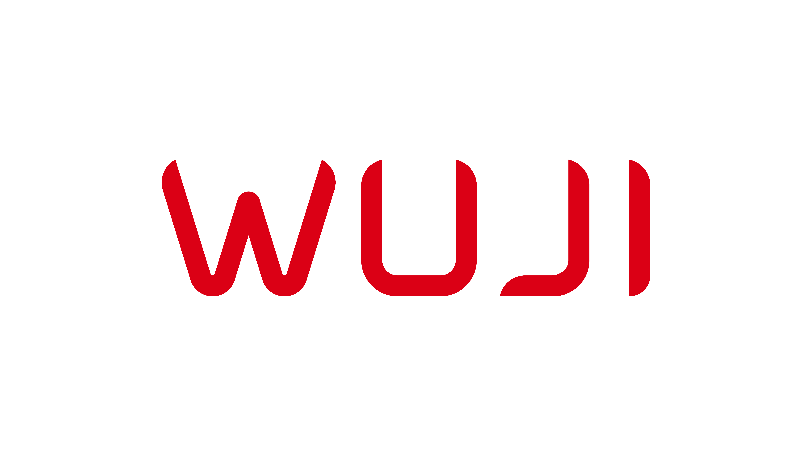

  
  <h3>From Hand to Mind</h3>

  We build high-DOF dexterous hands, data gloves, and a unified software stack for control and teleoperation. 
  Our mission is to accelerate progress of dexterous manipulation and embodied AI.

  <a href="https://wuji.tech">Website</a> ·
  <a href="https://docs.wuji.tech">Docs</a> ·
  <a href="https://x.com/wuji_global">X</a> ·
  <a href="https://youtube.com/@WUJI_TECH">YouTube</a> ·
  <a href="https://space.bilibili.com/3546938664291159">Bilibili</a>

---

## Product Ecosystem

<table>
  <tr>
    <td align="center">
      
       
      <strong>Wuji Hand</strong> — High-DOF dexterous hand
       
      <a href="https://docs.wuji.tech/docs/en/wuji-hand/latest">Docs</a>
    </td>
    <td align="center">
      
       
      <strong>Wuji Glove</strong> — Data glove for teleoperation
       
      <a href="https://docs.wuji.tech/docs/en/wuji-glove/latest">Docs</a>
    </td>
  </tr>
</table>

| Product | What It Does | Links |
|---------|-------------|-------|
| **Wuji Studio** | Desktop app for calibration, monitoring & debugging | [Docs](https://docs.wuji.tech/docs/en/wuji-studio/latest) |
| **Wuji SDK** | Unified API for all Wuji devices | [Docs](https://docs.wuji.tech/docs/en/wuji-sdk/latest) |

Explore all repositories at [github.com/wuji-technology](https://github.com/orgs/wuji-technology/repositories).

## Get Involved

- **Technical support** — [support@wuji.tech](mailto:support@wuji.tech) or open an issue in the relevant repo
- **Sales & partnerships** — [sales@wuji.tech](mailto:sales@wuji.tech)
- **Join us** (we hire internationally) — [hr@wuji.tech](mailto:hr@wuji.tech)
