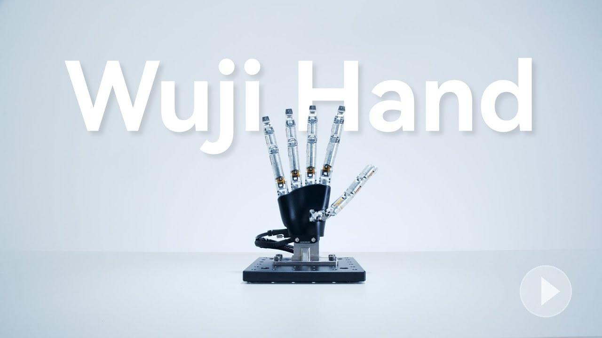
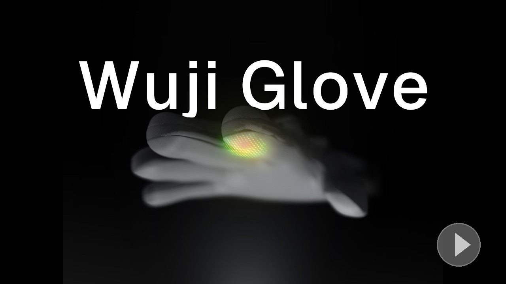

  

  We build high-DOF dexterous hands, data gloves, and a unified software stack 
  to accelerate dexterous manipulation and embodied AI.

  
  
  
  
  

## Product Ecosystem

<table>
  <tr>
    <td align="center" width="50%">
      
       
      <h3>Wuji Hand</h3>
      20-DOF dexterous hand with tactile sensing and FOC control  
      <a href="https://docs.wuji.tech/docs/en/wuji-hand/latest">Docs →</a>
    </td>
    <td align="center" width="50%">
      
       
      <h3>Wuji Glove</h3>
      Data glove with tactile matrix, 6-axis IMU, and finger tracking  
      <a href="https://docs.wuji.tech/docs/en/wuji-glove/latest">Docs →</a>
    </td>
  </tr>
  <tr>
    <td align="center" width="50%" height="120">
      <h3>Wuji Studio</h3>
      Desktop app for device management, data visualization, and firmware upgrade  
      <a href="https://docs.wuji.tech/docs/en/wuji-studio/latest">Docs →</a>
    </td>
    <td align="center" width="50%" height="120">
      <h3>Wuji SDK</h3>
      Python SDK for sensor streaming, hand pose computation, and recording  
      <a href="https://docs.wuji.tech/docs/en/wuji-sdk/latest">Docs →</a>
    </td>
  </tr>
</table>

## Repositories

<table>
  <tr>
    <td rowspan="3" width="120"><b>SDK</b></td>
    <td></td>
    <td>Automatic device discovery and real-time data streaming for all Wuji devices</td>
  </tr>
  <tr>
    <td></td>
    <td>Python/C++ SDK for Wuji Hand device control</td>
  </tr>
  <tr>
    <td></td>
    <td>ROS 2 driver with 1 kHz joint state publishing</td>
  </tr>
  <tr>
    <td rowspan="3"><b>Tools</b></td>
    <td></td>
    <td>Desktop application for all Wuji devices</td>
  </tr>
  <tr>
    <td></td>
    <td>Firmware upgrade tool for Wuji Hand</td>
  </tr>
  <tr>
    <td></td>
    <td>Real-time monitoring, calibration, and debugging for Wuji Hand</td>
  </tr>
  <tr>
    <td rowspan="3"><b>Simulation</b></td>
    <td></td>
    <td>URDF, MuJoCo MJCF, and mesh models</td>
  </tr>
  <tr>
    <td></td>
    <td>MuJoCo simulation demo</td>
  </tr>
  <tr>
    <td></td>
    <td>Isaac Lab simulation demo</td>
  </tr>
  <tr>
    <td><b>Teleoperation</b></td>
    <td></td>
    <td>Hand pose retargeting with Vision Pro support</td>
  </tr>
  <tr>
    <td><b>Hardware</b></td>
    <td></td>
    <td>CAD files (STEP) for adapters, frames, and softgoods</td>
  </tr>
  <tr>
    <td><b>Education</b></td>
    <td></td>
    <td>Lecture notes on rotation, screw theory, dynamics, and multibody systems</td>
  </tr>
</table>

## Get Involved

- **Technical support** — [support@wuji.tech](mailto:support@wuji.tech) or open an issue in the relevant repo
- **Sales & partnerships** — [sales@wuji.tech](mailto:sales@wuji.tech)
- **Join us** (we hire internationally) — [hr@wuji.tech](mailto:hr@wuji.tech)
