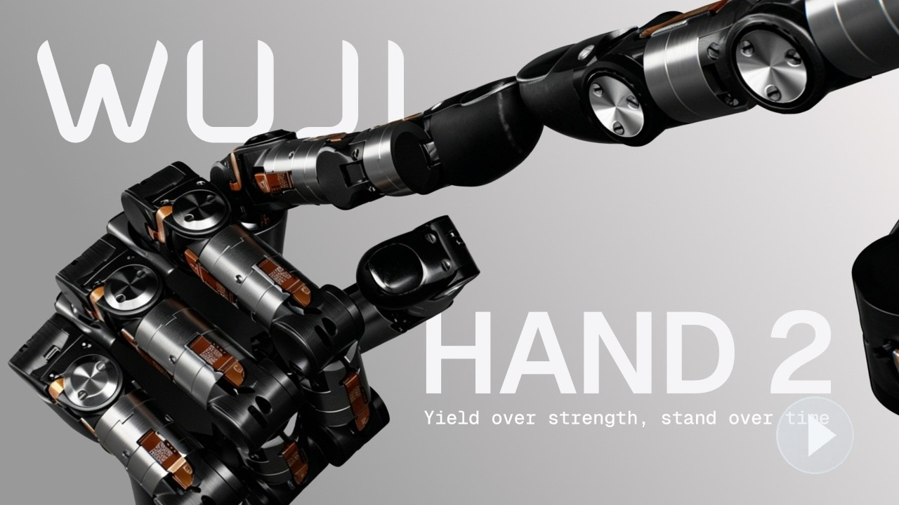
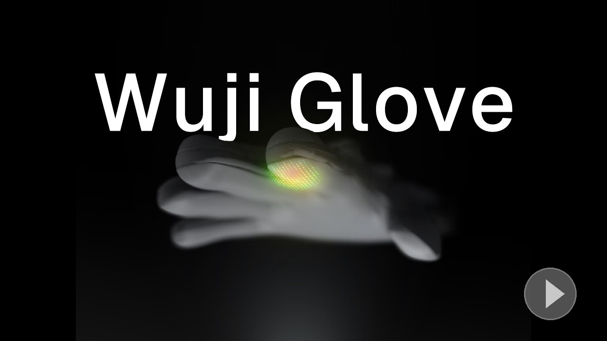

  
  

 

  We build high-DoF dexterous hands, data gloves, and a unified software stack 
  to accelerate dexterous manipulation and embodied AI.

  
  
  
  
  

## Product Ecosystem

<table>
  <tr>
    <td align="center" valign="top" width="50%">
      
       
      <h3>Wuji Hand 2</h3>
      20-DoF dexterous hand with back-drivable direct drive, FOC, and MIT force-position control  
      <a href="https://docs.wuji.tech/docs/en/wuji-hand/latest">Docs →</a>
    </td>
    <td align="center" valign="top" width="50%">
      
       
      <h3>Wuji Glove</h3>
      Data glove with tactile matrix, 6-axis IMU, and finger tracking  
      <a href="https://docs.wuji.tech/docs/en/wuji-glove/latest">Docs →</a>
    </td>
  </tr>
  <tr>
    <td align="center" width="50%" height="120">
      <h3>Wuji SDK</h3>
      Python and C SDK for device discovery, real-time data streaming, recording, and hand control  
      <a href="https://docs.wuji.tech/docs/en/wuji-sdk/latest">Docs →</a>
    </td>
    <td align="center" width="50%" height="120">
      <h3>Wuji CLI</h3>
      Command-line tool for device discovery, parameter access, diagnostics, and firmware upgrade  
      <a href="https://docs.wuji.tech/docs/en/wuji-cli/latest">Docs →</a>
    </td>
  </tr>
</table>

## Resources

- **Technical support** — [support@wuji.tech](mailto:support@wuji.tech) or open an issue in the relevant repo
- **Sales & partnerships** — [sales@wuji.tech](mailto:sales@wuji.tech)
- **Join us** (we hire internationally) — [talentpro@wuji.tech](mailto:talentpro@wuji.tech)
